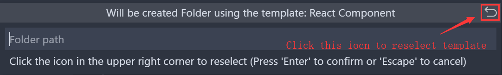
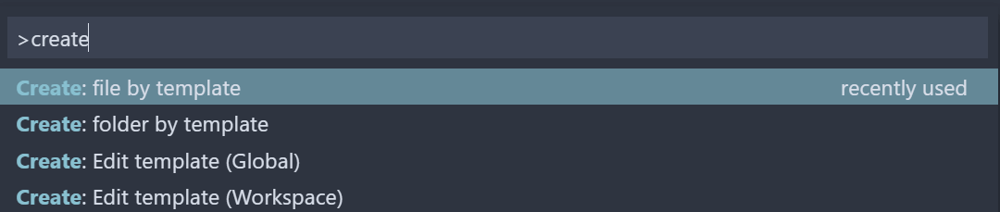
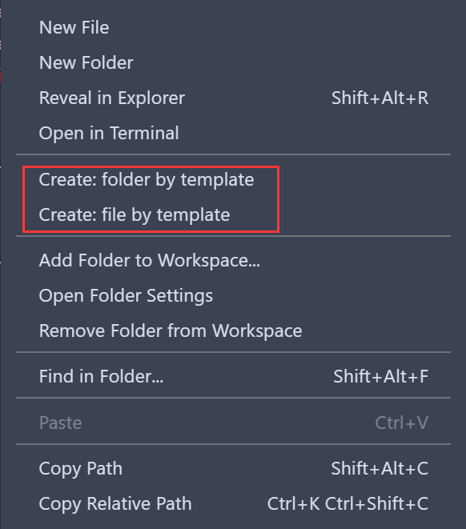

# create-item-by-template
[](https://marketplace.visualstudio.com/items?itemName=lanten.create-item-by-template)
<!-- [](https://marketplace.visualstudio.com/items?itemName=lanten.create-item-by-template) -->
[](https://marketplace.visualstudio.com/items?itemName=lanten.create-item-by-template)
[](https://marketplace.visualstudio.com/items?itemName=lanten.create-item-by-template)


This extension can help you quickly create a folder using a template

Create multiple files at the same time in a new folder and add custom text

[中文说明](./README.zh-cn.md)


## Commands

- Create: item by template
- Create: file by template
- Create: Edit template (Global)
- Create: Edit template (Workspace)


## Settings

| Name                         | Description                                    | Type    | Default |
| ---------------------------- | ---------------------------------------------- | ------- | ------- |
| create.defaultFolderTemplate | Template used by default when creating folders | string  | ''      |
| create.defaultFileTemplate   | Template used by default when creating files   | string  | ''      |
| create.rememberLastSelection | Remember last selected template                | boolean | false   |

Reselect the template:


## Using

#### Create with command :
Use shortcut keys <kbd>cmd</kbd> + <kbd>shift</kbd> + <kbd>p</kbd> Open command panel


#### Create in the explorer using the right-click menu:



## Template configuration

You can configure `global` and `workspace` templates separately

rule:

- The configuration file must have a default export: `module.exports = { files, folders }`
- `files` Will be parsed into a list of files
- `folders` Will be parsed into a list of folders
- Other fields passed in will be treated as folders
- Parameters can be passed in via `url search`, such as `? Type = 1` will be parsed into object: `{ type: 1 }`

Here is a simple example, see this [wiki](https://github.com/lanten/create-item-by-template/wiki/Template-Example) for more usage

```js
/** file list */
const files = {
  'Javascript Log': name => {
    return `console.log('${name}: is created')`
  },
}

/** folder list */
const folders = {
  // key is template name, value Can be: Function | string | string[]
  'Web Folder': (name, query, paths) => {
    return {
      // key Is the name of the file to be created, value can be: Function | string | string[]
      'index.html': [
        `<!DOCTYPE html>`,
        `<html lang="en">`,
        `<head>`,
        `  <meta name="viewport" content="width=device-width, initial-scale=1.0">`,
        `  <meta http-equiv="X-UA-Compatible" content="ie=edge">`,
        `  <script src="./${name}.js"></script>`,
        `  <title>${name}</title>`,
        `</head>`,
        `<body>`,
        `  <p>${JSON.stringify(query)}</p>`,
        `  <p>${JSON.stringify(paths)}</p>`,
        `</body>`,
        `</html>`,
      ],
      [`${name}.js`]: files['Javascript Log'](name),
    }
  },
}

module.exports = { files, folders }
```
