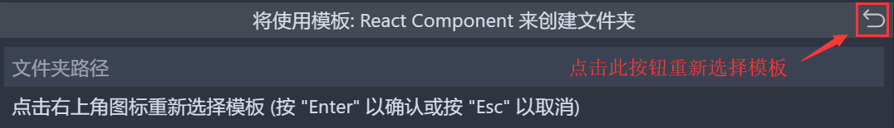
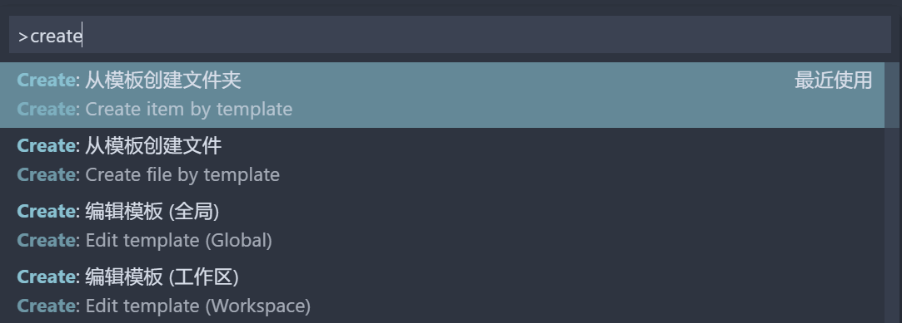
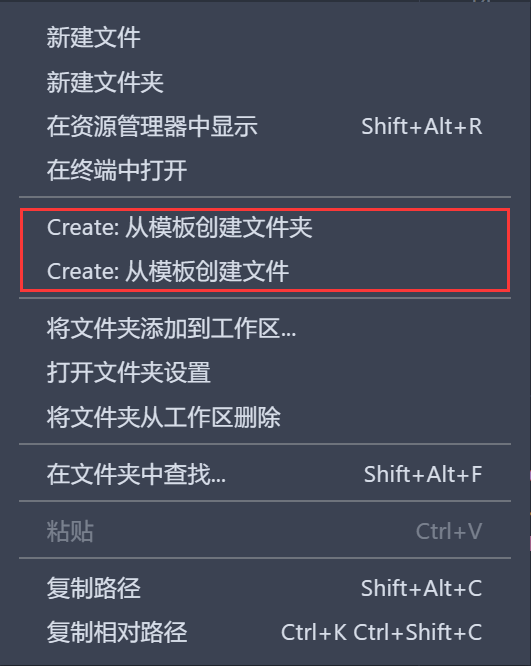

# create-item-by-template
[](https://marketplace.visualstudio.com/items?itemName=lanten.create-item-by-template)
<!-- [](https://marketplace.visualstudio.com/items?itemName=lanten.create-item-by-template) -->
[](https://marketplace.visualstudio.com/items?itemName=lanten.create-item-by-template)
[](https://marketplace.visualstudio.com/items?itemName=lanten.create-item-by-template)


本扩展插件可以帮助你快速创建组件化的文件夹

在新的文件夹中同时创建多个文件并加入定制文案

[English](./README.md)

## Commands

- Create: 从模板创建文件夹
- Create: 从模板创建文件
- Create: 编辑模板 (全局)
- Create: 编辑模板 (工作区)


## Settings

| 名称                         | 说明               | 类型   |
| ---------------------------- | ------------------ | ------ |
| create.defaultFolderTemplate | 默认文件夹模板     | string |
| create.defaultFileTemplate   | 默认文件模板       | string |
| create.rememberLastSelection | 记住上次选择的模板 | string |

重新选择模板：


## 开始使用

#### 使用命令创建 :
使用快捷键 <kbd>cmd</kbd> + <kbd>shift</kbd> + <kbd>p</kbd> 打开命令面板


#### 在资源管理器中使用右键菜单创建 :



## 模板配置

你可以分别配置 `全局` 和 `工作区` 模板

规则：

- 配置文件必须存在一个默认导出：`module.exports = { files, folders }`
- `files` 将被解析为文件列表
- `folders` 将被解析为文件夹列表
- 传入的其它字段将被视为文件夹
- 可以通过 `url search` 传入参数，如 `?type=1` 将被解析为对象：`{ type:1 }`

下面是一个简单的例子，更多用法请查看此 [wiki](https://github.com/lanten/create-item-by-template/wiki/Template-Example)

```js
/** file list */
const files = {
  'Javascript Log': name => {
    return `console.log('${name}: is created')`
  },
}

/** folder list */
const folders = {
  // key 是模板名称，value 可以是 Function | string | string[]
  'Web Folder': (name, query, paths) => {
    return {
      // key 是将要创建的文件名，value 可以是 Function | string | string[]
      'index.html': [
        `<!DOCTYPE html>`,
        `<html lang="en">`,
        `<head>`,
        `  <meta name="viewport" content="width=device-width, initial-scale=1.0">`,
        `  <meta http-equiv="X-UA-Compatible" content="ie=edge">`,
        `  <script src="./${name}.js"></script>`,
        `  <title>${name}</title>`,
        `</head>`,
        `<body>`,
        `  <p>${JSON.stringify(query)}</p>`,
        `  <p>${JSON.stringify(paths)}</p>`,
        `</body>`,
        `</html>`,
      ],
      [`${name}.js`]: files['Javascript Log'](name),
    }
  },
}

module.exports = { files, folders }
```
